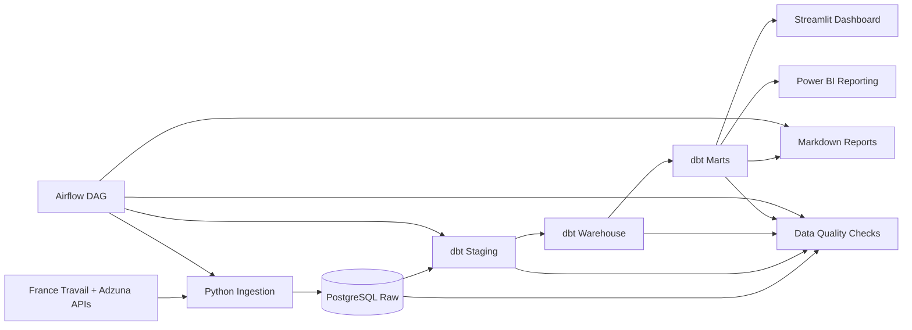

# Job Market Radar
[](https://github.com/VladimirVAR/job-market-radar/actions/workflows/ci.yml)

ELT pipeline: collects job postings from France Travail and Adzuna APIs, transforms
them through PostgreSQL and dbt, orchestrates with Airflow, and presents analytics in a
Streamlit dashboard.

Built to support a Data Engineering job search in France. Turns noisy job listings into
analytical signals: relevant job ranking, skill gap analysis, location and company demand,
and data freshness tracking across two live API sources.

---

## Tech Stack

| Area | Tool |
|---|---|
| Language | Python |
| Database | PostgreSQL |
| Transformations | dbt |
| Orchestration | Airflow |
| Dashboard | Streamlit |
| BI Reporting | Power BI |
| Environment | Docker / Docker Compose |
| Data modeling | SQL |

---

## Phase 2: Adzuna Integration Complete

Two job sources active and validated end-to-end in a Dockerized environment.

| Metric | Result |
|---|---|
| France Travail current jobs | 64 |
| Adzuna current jobs | 100 |
| mart_relevant_jobs (combined) | 164 |
| dbt build | PASS=187 WARN=0 ERROR=0 SKIP=0 |
| Airflow DAG tasks passed | 7 / 7 |

Full release notes: [docs/release/phase_2_adzuna_airflow_validation.md](docs/release/phase_2_adzuna_airflow_validation.md)

---

<details>
<summary><strong>Problem statement</strong></summary>

Job search is noisy. A candidate often sees many job postings with different titles,
inconsistent descriptions, unclear seniority expectations, and scattered skill requirements.

This project turns that unstructured job-search process into a small analytical system
that can answer questions such as:

- Which current jobs are most relevant to the candidate profile?
- Which skills are most demanded?
- Which skills are missing from the candidate profile?
- Which cities and companies are active in the target market?
- What changed in the market during the latest pipeline runs?

</details>

<details>
<summary><strong>Target user and MVP scope</strong></summary>

The primary MVP user is a junior or career-switching Data Engineering candidate in
France and Europe.

The candidate profile used by the MVP includes: Python, SQL, PostgreSQL, Docker, dbt,
Airflow, and AWS basics. Growth skills tracked may include Spark, Kafka, Snowflake,
BigQuery, Azure, GCP, Terraform, Kubernetes, and CI/CD.

**Implemented scope:**

- France Travail and Adzuna ingestion (two live API sources)
- Raw API response preservation in PostgreSQL as JSONB
- Load batch tracking and API request metadata tracking
- dbt staging, warehouse, and marts layers
- Snapshot and current-state job posting models
- Rule-based skill extraction
- Explainable relevance scoring
- Candidate Fit Score v1 for first-pass job prioritization
- Data quality checks
- Airflow orchestration
- Streamlit dashboard reading from marts
- Optional Power BI reporting layer connected to PostgreSQL marts for market analysis, relevant jobs review, and pipeline freshness monitoring
- Project documentation and runbooks

**Out of scope for the MVP:**

- LinkedIn or Indeed scraping
- Production deployment
- Machine learning recommendation system
- Real-time streaming architecture
- Advanced cross-source entity resolution

</details>

<details>
<summary><strong>Architecture overview</strong></summary>

The project follows a layered batch-oriented ELT architecture:

```text
sources
  -> raw
  -> staging
  -> warehouse
  -> marts
  -> dashboard / reports
```



**Component responsibilities:**

| Component | Responsibility |
|---|---|
| Python | API access, request building, raw loading, batch and request metadata |
| PostgreSQL | Local analytical store for raw data, dbt models, marts, and dashboard-ready outputs |
| dbt | Transformations after raw loading: staging, warehouse, marts, tests, and lineage |
| Airflow | Pipeline orchestration and task dependencies |
| Streamlit | Presentation and exploration layer |
| Markdown docs | Architecture, runbook, validation, release notes, and demo story |

**Why Streamlit consumes marts only:**

The dashboard is intentionally thin. Business pages read from `marts.*` only. dbt owns all
business transformations and metrics. Streamlit only presents and explores prepared data.

This keeps responsibilities clear and makes the project easier to test and explain.

</details>

<details>
<summary><strong>Pipeline flow</strong></summary>

```text
France Travail API + Adzuna API
  -> raw PostgreSQL tables
  -> dbt staging models (one per source)
  -> dbt warehouse models (snapshot + current, union of both sources)
  -> dbt marts
  -> data quality checks
  -> Streamlit dashboard
```

**Airflow DAG flow:**

```text
start
  -> [ingest_france_travail_raw_jobs, ingest_adzuna_raw_jobs]  (parallel)
  -> dbt_build
  -> run_data_quality_checks
  -> generate_weekly_report
  -> end
```

</details>

<details>
<summary><strong>Data sources</strong></summary>

**Implemented sources:**

| Source | Phase | Auth |
|---|---|---|
| France Travail API Offres d'emploi | Phase 1 | OAuth2 client credentials |
| Adzuna API | Phase 2 | API key via query params |

Both sources feed the same warehouse and mart layers through separate staging models.
`mart_data_freshness` shows one row per source so freshness is tracked independently.

Both sources support a sample mode for local demos without live API credentials.

**Future sources:**

- The Muse API

**Explicitly excluded:**

- LinkedIn scraping
- Indeed scraping
- Any source that violates website Terms of Service

</details>

<details>
<summary><strong>Data model summary</strong></summary>

**Raw tables:**

- `raw.raw_load_batches`
- `raw.raw_api_requests`
- `raw.raw_france_travail_job_postings`
- `raw.raw_adzuna_job_postings`

**dbt models:**

- `staging.stg_france_travail_job_postings`
- `staging.stg_adzuna_job_postings`
- `warehouse.wh_job_posting_snapshots` (union of both staging sources)
- `warehouse.wh_job_posting_current`
- `marts.mart_job_postings_current`
- `marts.mart_job_market_overview`
- `marts.mart_skill_demand`
- `marts.mart_location_demand`
- `marts.mart_company_demand`
- `marts.mart_data_freshness` (one row per source)
- `marts.mart_relevant_jobs`
- `marts.mart_missing_skills`
- `marts.mart_location_activity`
- `marts.mart_company_activity`
- `marts.mart_weekly_market_summary`
- `marts.mart_relevant_jobs_flat` (Power BI friendly flat view of relevant jobs with ARRAY fields converted to text)
- `marts.mart_pipeline_health` (source-level pipeline health and freshness mart for pipeline monitoring)

See `docs/data_catalog.md` for model-level grain and field documentation.

See `docs/powerbi_reporting.md` for Power BI connection details, consumed marts, dashboard pages, and local .pbix handling.

</details>

<details>
<summary><strong>Candidate Fit Score and dashboard</strong></summary>

**Candidate Fit Score v1** is an explainable rule-based signal that ranks live job postings
for a career-switching junior Data Engineer profile.

Calculated in `marts.mart_relevant_jobs`. Streamlit presents the prepared fields:

- `candidate_fit_score`
- `candidate_fit_band`
- `application_priority`
- `candidate_fit_reason`
- `matched_candidate_skills`
- `missing_growth_skills`

The score is rule-based and deterministic. It is not AI/ML and not a hiring decision.
It is a first-pass prioritization signal designed to make the dashboard useful and explainable.

See `docs/product/candidate_profile_v1.md`, `docs/product/relevance_scoring_v1.md`, and
`docs/architecture/scoring_contract.md`.

**Dashboard pages:**

- Overview
- Relevant Jobs (with Candidate Fit Score and source filter for France Travail / Adzuna)
- Skill Radar
- Locations
- Companies
- Weekly Report
- Data Freshness (per source)

**Example analytical outputs:**

- Best matching current jobs with explanation
- Top demanded skills
- Top missing skills for the candidate profile
- Top cities and regions by job count
- Companies with repeated postings
- Weekly new jobs summary
- Source coverage and data freshness per API

</details>

<details>
<summary><strong>How to run locally</strong></summary>

See the full runbook in `docs/local_runbook.md`.

**Prerequisites:** Docker Desktop running, credentials in `.env`.

```bash
cp .env.example .env
# Fill in: FRANCE_TRAVAIL_CLIENT_ID, FRANCE_TRAVAIL_CLIENT_SECRET,
#           ADZUNA_APP_ID, ADZUNA_APP_KEY
```

```bash
docker compose up -d
```

**Manual ingestion:**

```bash
python -m src.pipeline.run_france_travail_ingestion
python -m src.pipeline.run_adzuna_ingestion
```

**dbt transformation:**

```bash
dbt build --project-dir dbt_job_market_radar --profiles-dir dbt_job_market_radar
```

**Data quality checks:**

```bash
python -m src.pipeline.run_data_quality_checks
```

**Streamlit dashboard:**

```bash
streamlit run streamlit_app/app.py
```

**Or trigger the full Airflow DAG.** It handles ingestion from both sources, dbt build,
DQ checks, and report generation in the correct dependency order.

</details>

<details>
<summary><strong>Validation</strong></summary>

A successful Airflow run is not enough. A complete validation means:

- ingestion completed for both sources
- dbt build completed with no errors or warnings
- data quality checks passed
- mart outputs are populated and available
- Streamlit can read the prepared marts

**Phase 2 end-to-end Airflow validation (Dockerized):**

| Task | Result |
|---|---|
| start | success |
| ingest_france_travail_raw_jobs | success |
| ingest_adzuna_raw_jobs | success |
| dbt_build | success |
| run_data_quality_checks | success |
| generate_weekly_report | success |
| end | success |

**Final data state:**

| Table / mart | Count |
|---|---|
| warehouse.wh_job_posting_current (france_travail) | 64 |
| warehouse.wh_job_posting_current (adzuna) | 100 |
| marts.mart_relevant_jobs | 164 |

dbt build: `PASS=187 WARN=0 ERROR=0 SKIP=0`

Note: snapshot row counts are doubled relative to current counts because both manual
ingestion and the Airflow DAG ran during Phase 2 validation.

</details>

<details>
<summary><strong>Repository structure</strong></summary>

```text
job-market-radar/
  README.md
  docker-compose.yml
  .env.example
  requirements.txt

  src/
    common/
    ingestion/
      france_travail/
      adzuna/
    loaders/
    pipeline/
    reporting/

  dags/
    job_market_radar_dag.py

  dbt_job_market_radar/
    models/
      sources/
      staging/
        france_travail/
        adzuna/
      warehouse/
      marts/
    tests/

  streamlit_app/
    app.py
    db.py
    pages/

  sql/
    ddl/
    analytics/

  docs/
  reports/
    task_execution/
```

</details>

<details>
<summary><strong>Screenshots</strong></summary>

The repository includes live-data MVP screenshots in `docs/screenshots/`.

| Area | Screenshot |
|---|---|
| Overview | `docs/screenshots/streamlit_overview.png` |
| Relevant Jobs / Candidate Fit | `docs/screenshots/streamlit_relevant_jobs_candidate_fit.png` |
| Candidate Fit Details | `docs/screenshots/streamlit_relevant_jobs_candidate_fit_details.png` |
| Skill Radar | `docs/screenshots/streamlit_skill_radar.png` |
| Locations | `docs/screenshots/streamlit_locations.png` |
| Companies | `docs/screenshots/streamlit_companies.png` |
| Weekly Report | `docs/screenshots/streamlit_weekly_report.png` |
| Data Freshness | `docs/screenshots/streamlit_data_freshness.png` |
| Airflow DAG Validation | `docs/screenshots/airflow_dag_success.png` |

Screenshots are captured from the local live-data MVP and do not include credentials or secrets.

</details>

<details>
<summary><strong>Key engineering decisions</strong></summary>

| Decision | Reason |
|---|---|
| PostgreSQL as local analytical store | Reproducible local MVP, JSONB support, dbt compatibility |
| Preserve raw API responses as JSONB | Traceability, debugging, reprocessing, lineage |
| Track every pipeline run as a batch | Operational lineage and historical analysis |
| Use dbt after raw loading | Clear ELT transformations, tests, documentation, lineage |
| Use Airflow for orchestration | Explicit task dependencies and pipeline visibility |
| Streamlit consumes marts only | Clean separation between business logic and UI |
| Rule-based skill extraction in MVP | Explainable, simple, easy to validate |
| Snapshot + current-state warehouse models | Historical observations plus current dashboard views |
| Uniform staging schema across sources | Both sources feed the same warehouse and mart models without extra joins |

</details>

<details>
<summary><strong>Known limitations</strong></summary>

- Streamlit was manually verified after Phase 2 validation against populated marts. The dashboard is not deployed publicly; it runs locally in the Docker/local development environment.
- Live API modes require valid credentials for France Travail and Adzuna.
- The local dataset size depends on API rate limits and the configured page count per source.
- Skill extraction is rule-based and may miss synonyms or produce false positives.
- Candidate Fit Score v1 is rule-based and deterministic. It is not a machine learning model.
- Candidate Profile v1 is hardcoded for the MVP with no UI editor or multi-user support.
- Weekly history is limited until more scheduled pipeline runs accumulate.
- Deployment is not in scope for the MVP.
- No LinkedIn or Indeed scraping is used.

</details>

<details>
<summary><strong>Future improvements</strong></summary>

- Add more job sources (e.g., The Muse API).
- Add longer historical trend tracking.
- Improve skill extraction with better NLP.
- Add salary normalization if reliable salary fields become available.
- Add multiple candidate profiles.
- Improve relevance scoring.
- Add configurable candidate profiles and score weighting.
- Track Candidate Fit Score historically across pipeline runs.
- Add optional hosted deployment.
- Add automated screenshot and demo generation.

</details>
