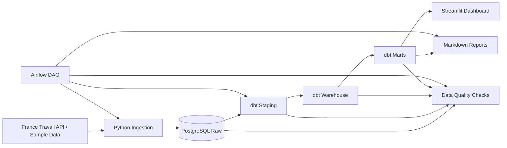

# Job Market Radar

Job Market Radar is a local Data Engineering data product built to support a real Data Engineering job search. It collects job postings from public job APIs, preserves raw source responses, transforms them into analytical models, extracts market signals, and helps a junior or career-switching Data Engineer prioritize relevant opportunities and skill gaps.

---

## Problem Statement

Job search is noisy. A candidate often sees many job postings with different titles, inconsistent descriptions, unclear seniority expectations, and scattered skill requirements.

This project turns that unstructured job-search process into a small analytical system that can answer questions such as:

- Which current jobs are most relevant to the candidate profile?
- Which skills are most demanded?
- Which skills are missing from the candidate profile?
- Which cities and companies are active in the target market?
- What changed in the market during the latest pipeline runs?

---

## Target User

The primary MVP user is a junior or career-switching Data Engineering candidate in France / Europe.

The candidate profile used by the MVP includes:

- Python
- SQL
- PostgreSQL
- Docker
- dbt
- Airflow
- AWS basics
- Data Engineering fundamentals

Growth skills tracked by the MVP may include Spark, Kafka, Snowflake, BigQuery, Azure, GCP, Terraform, Kubernetes, and CI/CD.

---

## MVP Scope

Implemented MVP scope:

- France Travail / sample-source ingestion
- Raw API response preservation in PostgreSQL
- Load batch tracking
- API request metadata tracking
- dbt staging, warehouse, and marts layers
- Snapshot and current-state job posting models
- Rule-based skill extraction
- Simple explainable relevance scoring
- Candidate Fit Score v1 for first-pass job prioritization
- Data quality checks
- Airflow orchestration
- Streamlit dashboard reading from marts
- Project documentation, runbooks, and screenshots

Out of scope for the MVP:

- LinkedIn or Indeed scraping
- Production deployment
- Machine learning recommendation system
- Real-time streaming architecture
- Advanced cross-source entity resolution

---

## Candidate Fit Score v1

The dashboard includes a **Candidate Fit Score**: an explainable rule-based signal that ranks live job postings for a career-switching junior Data Engineer profile.

The score helps answer:

```text
Which jobs are most relevant for this candidate, and why?
```

Candidate Fit Score is calculated in the dbt marts layer and exposed through `marts.mart_relevant_jobs`. Streamlit only displays the prepared fields.

The score is not AI/ML, not a guarantee that the candidate should apply, and not a final hiring decision. It is a first-pass prioritization signal designed to make the dashboard more useful and explainable.

Candidate Fit fields include:

- `candidate_fit_score`
- `candidate_fit_band`
- `application_priority`
- `candidate_fit_reason`
- `matched_candidate_skills`
- `missing_growth_skills`

See:

- `docs/product/candidate_profile_v1.md`
- `docs/product/relevance_scoring_v1.md`
- `docs/architecture/scoring_contract.md`

---

## Architecture Overview

The project follows a layered batch-oriented ELT architecture:

```text
sources
  -> raw
  -> staging
  -> warehouse
  -> marts
  -> dashboard / reports
```



### Component Responsibilities

| Component | Responsibility |
|---|---|
| Python | API access, request building, raw loading, batch/request metadata |
| PostgreSQL | Local analytical store for raw data, dbt models, marts, and dashboard-ready outputs |
| dbt | Transformations after raw loading: staging, warehouse, marts, tests, lineage |
| Airflow | Pipeline orchestration and task dependencies |
| Streamlit | Presentation and exploration layer |
| Markdown docs | Architecture, runbook, validation, release notes, and demo story |

---

## Why Streamlit Consumes Marts Only

The dashboard is intentionally thin.

Streamlit business pages read from `marts.*` only. They do not calculate relevance scores, skill demand, missing skills, or weekly summaries directly.

This keeps responsibilities clear:

- dbt owns business transformations and metrics.
- marts expose dashboard-ready analytical outputs.
- Streamlit only presents and explores prepared data.

This design required adding an intermediate Task 011A for analytics marts before Task 011B for Streamlit. The decision keeps the architecture cleaner and makes the project easier to test, explain, and extend.

---

## Tech Stack

| Area | Tool |
|---|---|
| Language | Python |
| Database | PostgreSQL |
| Transformations | dbt |
| Orchestration | Airflow |
| Dashboard | Streamlit |
| Local environment | Docker / Docker Compose |
| Data modeling | SQL |
| Documentation | Markdown |

---

## Repository Structure

Expected project structure:

```text
job-market-radar/
  README.md
  docker-compose.yml
  .env.example
  requirements.txt

  src/
    ingestion/
    loaders/
    pipeline/
    reporting/

  dags/
    job_market_radar_dag.py

  dbt_job_market_radar/
    models/
      sources/
      staging/
      warehouse/
      marts/
    tests/

  streamlit_app/
    app.py
    db.py
    pages/

  docs/
    architecture.md
    data_flow.md
    data_catalog.md
    demo_guide.md
    demo_script.md
    local_runbook.md
    validation_summary.md
    limitations_and_future_work.md

  reports/
    task_execution/
```

---

## Data Source

### MVP source

- France Travail API Offres d'emploi

### Local validation mode

- Sample-mode ingestion can be used for reliable local demos without depending on live API availability.

### Future sources

- Adzuna API
- The Muse API

### Explicitly excluded

- LinkedIn scraping
- Indeed scraping
- Any source that violates website Terms of Service

---

## Pipeline Flow

The implemented MVP flow is:

```text
France Travail / sample source
  -> raw PostgreSQL tables
  -> dbt staging models
  -> dbt warehouse models
  -> dbt marts
  -> data quality checks
  -> Airflow orchestration
  -> Streamlit dashboard
```

Airflow DAG flow:

```text
start
  -> ingest_france_travail_raw_jobs
  -> dbt_build
  -> run_data_quality_checks
  -> generate_weekly_report placeholder
  -> end
```

---

## Data Model Summary

Main raw tables:

- `raw.raw_load_batches`
- `raw.raw_api_requests`
- `raw.raw_france_travail_job_postings`

Main dbt models:

- `staging.stg_france_travail_job_postings`
- `warehouse.wh_job_posting_snapshots`
- `warehouse.wh_job_posting_current`
- `marts.mart_job_postings_current`
- `marts.mart_job_market_overview`
- `marts.mart_skill_demand`
- `marts.mart_location_demand`
- `marts.mart_company_demand`
- `marts.mart_data_freshness`
- `marts.mart_relevant_jobs`
- `marts.mart_missing_skills`
- `marts.mart_location_activity`
- `marts.mart_company_activity`
- `marts.mart_weekly_market_summary`

Every important model should have a documented grain. See `docs/data_catalog.md` for model-level details.

---

## Dashboard Summary

The Streamlit dashboard includes:

- Overview
- Relevant Jobs
- Skill Radar
- Locations
- Companies
- Weekly Report
- Data Freshness

Business pages read from `marts.*` only.

The Relevant Jobs page displays Candidate Fit Score fields from `marts.mart_relevant_jobs`, including application priority, candidate fit band, matched skills, missing growth skills, and candidate fit explanation.

The Streamlit database access layer includes guardrails to reject accidental business-page queries against `raw.*`, `staging.*`, or `warehouse.*`.

---

## Screenshots

The repository includes live-data MVP screenshots in `docs/screenshots/`.

Recommended screenshots for a quick project review:

| Area | Screenshot |
|---|---|
| Overview | `docs/screenshots/streamlit_overview.png` |
| Relevant Jobs / Candidate Fit | `docs/screenshots/streamlit_relevant_jobs_candidate_fit.png` |
| Candidate Fit Details | `docs/screenshots/streamlit_relevant_jobs_candidate_fit_details.png` |
| Skill Radar | `docs/screenshots/streamlit_skill_radar.png` |
| Locations | `docs/screenshots/streamlit_locations.png` |
| Companies | `docs/screenshots/streamlit_companies.png` |
| Weekly Report | `docs/screenshots/streamlit_weekly_report.png` |
| Data Freshness | `docs/screenshots/streamlit_data_freshness.png` |
| Airflow DAG Validation | `docs/screenshots/airflow_dag_success.png` |

Screenshots are captured from the local live-data MVP and should not include secrets, API keys, `.env` files, or private credentials.

---

## How to Run Locally

See the full runbook in `docs/local_runbook.md`.

Typical local flow:

```bash
cp .env.example .env
```

```bash
docker compose up -d
```

```bash
python -m src.pipeline.run_france_travail_ingestion
```

```bash
dbt build --project-dir dbt_job_market_radar --profiles-dir dbt_job_market_radar
```

```bash
python -m src.pipeline.run_data_quality_checks
```

```bash
streamlit run streamlit_app/app.py
```

Airflow can be triggered manually after services are running:

```bash
airflow dags trigger job_market_radar
```

If Airflow is running inside Docker, execute the command from the appropriate Airflow container or use the Airflow UI.

---

## Validation

Validation is intentionally separate from orchestration.

A successful Airflow run is not enough. For this project, a successful pipeline means:

- ingestion completed
- dbt build completed
- data quality checks passed
- dashboard marts are available
- Streamlit can read the prepared marts

Validated commands used by the project:

```bash
dbt build --project-dir dbt_job_market_radar --profiles-dir dbt_job_market_radar
```

```bash
python -m src.pipeline.run_data_quality_checks
```

```bash
streamlit run streamlit_app/app.py
```

---

## Example Analytical Outputs

The marts and dashboard are designed to support outputs such as:

- Best matching current jobs
- Top demanded skills
- Top missing skills
- Top cities and regions
- Companies with repeated postings
- Weekly new jobs summary
- Source coverage and data freshness
- Duplicate or lineage validation examples

---

## Key Engineering Decisions

| Decision | Reason |
|---|---|
| PostgreSQL as local analytical store | Reproducible local MVP, JSONB support, dbt compatibility |
| Preserve raw API responses as JSONB | Traceability, debugging, reprocessing, lineage |
| Track every pipeline run as a batch | Operational lineage and historical analysis |
| Use dbt after raw loading | Clear ELT transformations, tests, documentation, lineage |
| Use Airflow for orchestration | Explicit task dependencies and pipeline visibility |
| Streamlit consumes marts only | Clean separation between business logic and UI |
| Rule-based skill extraction in MVP | Explainable, simple, easy to validate |
| Snapshot + current-state warehouse models | Historical observations plus current dashboard views |

---

## Known Limitations

- France Travail sample-mode is used for reliable local validation.
- Live API mode may require valid France Travail API credentials.
- The local demo dataset may be small.
- Skill extraction is rule-based and may miss synonyms or produce false positives.
- Relevance scoring is simple and explainable, not machine learning.
- Candidate Fit Score v1 is rule-based and deterministic; it is not a machine learning recommendation model.
- Candidate Profile v1 is hardcoded for the MVP and has no UI editor or multi-user support.
- Weekly history is limited until more scheduled runs accumulate.
- The Streamlit UI is intentionally simple.
- `generate_weekly_report` in Airflow is currently a placeholder.
- Deployment is not in scope for the MVP.
- No LinkedIn or Indeed scraping is used.

---

## Future Improvements

- Add more job sources such as Adzuna or The Muse.
- Add longer historical trend tracking.
- Improve skill extraction with better NLP.
- Add salary normalization if reliable salary fields become available.
- Add multiple candidate profiles.
- Improve relevance scoring.
- Add configurable candidate profiles and score weighting.
- Track Candidate Fit Score historically across pipeline runs.
- Add CI checks.
- Add optional hosted deployment.
- Add automated screenshot and demo generation.
- Replace the weekly report placeholder with a generated report artifact.

---
