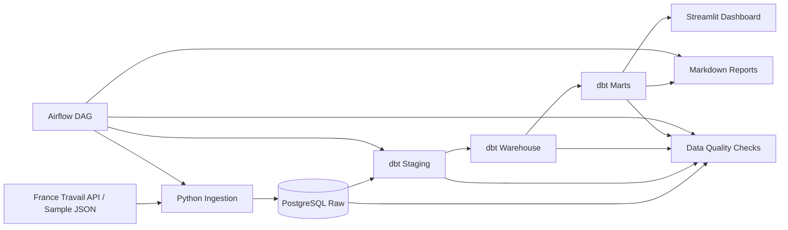

# Architecture

## Purpose

This document explains the Job Market Radar architecture, component boundaries, and the main engineering trade-offs.

Job Market Radar is a local, batch-oriented Data Engineering MVP. It is not designed as a production hiring platform. The goal is to provide a clean, reproducible data product architecture for a practical job-search use case.

---

## High-Level Architecture

```text
sources
  -> raw
  -> staging
  -> warehouse
  -> marts
  -> dashboard / reports
```



---

## Source Layer

### MVP source

- France Travail API Offres d'emploi

### Local demo source

- Sample data mode for repeatable local validation

### Future sources

- Adzuna API
- The Muse API

### Excluded sources

- LinkedIn scraping
- Indeed scraping
- Any data collection that violates website Terms of Service

The MVP intentionally starts with one legal/public source because the goal is to prove the full data product flow before expanding coverage.

---

## Raw Layer

The raw layer is loaded by Python and stored in PostgreSQL.

Raw tables:

- `raw.raw_load_batches`
- `raw.raw_api_requests`
- `raw.raw_france_travail_job_postings`

Responsibilities:

- Preserve source responses before transformation.
- Store API request metadata.
- Track every pipeline execution as a load batch.
- Keep lineage keys such as `batch_id`, `request_id`, `source_job_key`, and `search_scope_key`.

Raw job payloads are stored as JSONB so the original source response can be inspected and reprocessed later.

The raw layer should not contain analytical business logic.

---

## Staging Layer

The staging layer is built by dbt.

Main model:

- `staging.stg_france_travail_job_postings`

Responsibilities:

- Parse JSON fields from raw payloads.
- Cast data types.
- Normalize column names.
- Extract source-specific fields into typed columns.
- Preserve lineage back to raw records.

Staging is still source-specific. It prepares clean fields but does not own final product metrics.

---

## Warehouse Layer

The warehouse layer is built by dbt and contains canonical analytical structures.

Main models:

- `warehouse.wh_job_posting_snapshots`
- `warehouse.wh_job_posting_current`

Responsibilities:

- Store historical job observations.
- Expose the latest known job state.
- Support active/inactive job logic.
- Preserve lineage to raw data.
- Prepare reusable analytical entities for marts.

### Snapshot and current-state design

Job postings can appear, change, disappear, and sometimes reappear. For that reason, the MVP uses two warehouse models:

```text
warehouse.wh_job_posting_snapshots
warehouse.wh_job_posting_current
```

Snapshots preserve historical observations.

Current-state exposes the latest known version of each canonical job posting.

For the MVP:

```text
canonical_job_key = source_job_key
```

Future multi-source matching can improve this key strategy.

### Important inactive-job limitation

A job should only be marked inactive when it is missing from a later batch with the same `search_scope_key`.

A job missing from a different search scope does not prove that it disappeared from the source.

---

## Marts Layer

The marts layer is built by dbt and consumed by Streamlit and reports.

Main marts:

- `marts.mart_job_postings_current`
- `marts.mart_job_market_overview`
- `marts.mart_skill_demand`
- `marts.mart_location_demand`
- `marts.mart_company_demand`
- `marts.mart_data_freshness`
- `marts.mart_relevant_jobs`
- `marts.mart_missing_skills`
- `marts.mart_location_activity`
- `marts.mart_company_activity`
- `marts.mart_weekly_market_summary`

Responsibilities:

- Provide dashboard-ready outputs.
- Contain product-facing metrics.
- Support filters, charts, and tables in Streamlit.
- Keep business logic outside the UI.

---

## Dashboard Layer

The dashboard is implemented with Streamlit.

Pages:

- Overview
- Relevant Jobs
- Skill Radar
- Locations
- Companies
- Weekly Report
- Data Freshness

Streamlit is a consumption layer. Business pages read from `marts.*` only.

The dashboard should not calculate:

- relevance score
- skill demand
- missing skill priority
- weekly summary metrics

Those calculations belong in dbt marts.

A technical freshness/debug page may display operational metadata, but product metrics should still come from marts.

---

## Orchestration Layer

Airflow orchestrates the MVP pipeline.

DAG flow:

```text
start
  -> ingest_france_travail_raw_jobs
  -> dbt_build
  -> run_data_quality_checks
  -> generate_weekly_report placeholder
  -> end
```

Airflow responsibilities:

- Task order
- Scheduling
- Retries
- Logs
- Manual pipeline trigger
- Visibility into pipeline execution

Airflow should not contain transformation SQL or dashboard logic.

---

## Data Quality Layer

Data quality checks run across multiple layers.

Validation includes:

- dbt source/model tests
- custom dbt data tests
- Python data quality runner
- validation contract documentation

Validation protects:

- raw completeness
- lineage keys
- staging field quality
- warehouse uniqueness
- mart sanity checks
- dashboard readiness

Important principle:

```text
Airflow success is not enough.
```

A successful pipeline run means ingestion, dbt build, validation checks, and dashboard mart availability all work together.

---

## Key Architecture Decisions and Trade-Offs

### PostgreSQL instead of a cloud warehouse

PostgreSQL is used because it runs easily in Docker, supports JSONB, works with Python and dbt, and keeps the MVP reproducible locally.

Trade-off: it does not demonstrate Snowflake, BigQuery, or Redshift.

### Raw JSONB preservation

Raw job payloads are stored as JSONB to preserve source truth, enable debugging, and support reprocessing.

Trade-off: raw tables are less user-friendly and require a clear separation from analytical layers.

### Batch tracking

Every pipeline run gets a `batch_id`, propagated downstream where needed.

Trade-off: it adds metadata complexity, but improves lineage and historical analysis.

### dbt for transformations

Python loads raw data, while dbt owns transformations after raw loading.

Trade-off: some transformations could be faster to write in Python, but dbt provides clearer lineage, tests, and documentation.

### Airflow for orchestration

Airflow provides recognized orchestration value, dependencies, logs, and scheduling.

Trade-off: it adds local setup complexity for a small MVP.

### Streamlit consumes marts only

Streamlit is intentionally thin and reads dashboard-ready marts.

Trade-off: adding a dashboard metric often requires changing dbt marts first, but the architecture stays cleaner.

### Rule-based skill extraction

The MVP uses dictionary/rule-based matching for transparency and explainability.

Trade-off: it may miss synonyms or produce false positives compared with NLP or ML methods.

---

## Architecture Summary

The architecture is intentionally simple:

```text
Python loads raw data.
dbt transforms it.
Airflow orchestrates it.
Streamlit displays prepared marts.
Validation checks protect correctness.
```

This separation makes the project easier to test, explain, and extend without overstating production readiness.
